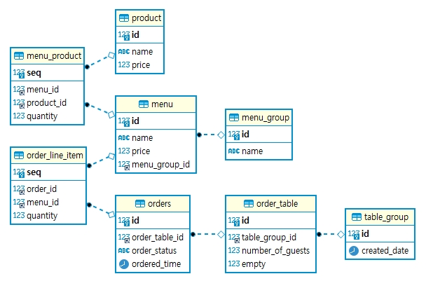

# 3 단계 - 의존성 리팩토링

## 요구사항

- 메뉴 이름과 가격이 변경 시, 주문항목도 함께 변경된다. 메뉴 정보가 변경되더라도 주문 항목이 변경 안되도록 한다
- 클래스 간 방향과 패키지 간의 방향이 단방향이 되도록 한다

1. 패키지 간의 객체 참조는 ID 참조로 개선

    - 새로운 절차지향적 객체를 만들어서 리팩토링

2. 이벤트 퍼블리싱으로 서비스들 간의 의존성 개선

## 기능 목록

- 도메인 레이어 의존성 개선: 객체 참조를 ID 참조로 변경하여 개선
    - MenuProduct 의 Product 참조
        - MenuValidator 생성
    - OrderLineItem 의 Menu 참조
    - Order 의 OrderTable 참조
- 패키지 내 객체 의존성 개선: 객체 간 단방향 관계로 변경
    - TableGroup 의 OrderTables 관계 끊기
- 이벤트 퍼블리싱 기법을 통해 의존성 개선

## 의존성 구조

현재

- 

개선 목표

- 

-----

# 2단계 - 서비스 리팩터링

## 요구사항

- 쉬운 단위테스트가 가능한 코드들부터 단위테스트 구현
- Spring Data JPA 사용 시, `spring.jpa.hibernate.ddl-auto=validate` 옵션 필수
- 데이터베이스 마이그레이션 형상 관리 써보기
- Lombok 사용 금지
- Google Java Style Guide 스타일 가이드 사용
- 들여쓰기는 4 spaces
- 들여쓰기는 2단계 까지만 허용. 예시: 반복문 안에 if 문이 있는 경우는 안된다.
- 3항 연산자를 쓰지 않는다
- else, switch-case 예약어를 사용하지 않는다
- 모든 기능을 TDD 로 구현한다. 단위테스트가 존재해야 한다
- 함수의 길이가 10라인을 넘어가면 안된다
- 배열 대신 컬렉션을 사용한다
- 모든 원시값과 문자열을 포장한다
- 축약 금지
- 일급 컬렉션 사용
- 모든 엔티티를 작게 유지하기
- 3개 이상의 인스턴스 변수를 가진 클래스 금지
- 비니지스 로직은 도메인 객체에 둬서 구현하기

## 도메인 설계

- 공통
    - [x] Name
    - [x] Price
- 상품
    - [x] Product
- 메뉴
    - [x] Menu
    - [x] MenuGroup
    - [x] MenuProduct
- 주문
    - [x] OrderLineItem
    - [x] Order
- 테이블
    - [x] TableGroup
    - [x] OrderTable

# 1단계 - 테스트를 통한 코드 보호

## 요구사항

1. 키친포스 요구사항 정리
2. 비지니스 오브젝트에 대한 테스트 코드 작성
    - Mock 을 통한 단위 테스트 코드 또는 통합 테스트 작성
3. (옵션) 인수 테스트 작성

## 기능 목록

- [x] 상품 서비스 테스트
- [x] 메뉴 그룹 서비스 테스트
- [x] 메뉴 서비스 테스트
- [x] 테이블 그룹 서비스 테스트
- [x] 테이블 서비스 테스트
- [x] 주문 서비스 테스트

----

# 키친포스

## 요구 사항

### 상품 product

- 상품을 등록한다
- 상품 가격이 올바르지 않으면 등록 안된다
    - 상품 가격이 0원 이상이어야 한다
- 상품 목록을 조회한다

### 메뉴 그룹 menu group

- 메뉴 그룹을 생성한다
- 메뉴 그룹 목록을 조회한다

### 메뉴 menu

- 메뉴를 등록한다
- 메뉴 등록 조건
    - 메뉴 가격이 0 이상이어야 한다
    - 메뉴 그룹 지정을 해야 한다
    - 메뉴의 상품이 모두 등록되어 있어야 한다
    - 메뉴 가격이 제품들의 가격 합과 같아야 한다
- 메뉴 목록을 조회한다

### 단체 지정 table group

- 단체 지정을 생성한다
- 단체 지정 조건
    - 주문 테이블들의 수가 2개 이상이어야 한다
    - 주문 테이블들이 모두 존재해야 한다
    - 빈 주문테이블이 하나라도 있으면 안된다
- 단체 지정을 해제한다
- 단체 지정 해제 조건
    - 조리 중이거나 식사 중인 주문 테이블은 해제가 안된다

### 주문 테이블 order, empty table

- 주문 테이블을 생성한다
- 주문 테이블 목록을 조회한다
- 주문 테이블을 빈 테이블로 변경한다
    - 테이블 그룹에 속해있지 않아야 한다
    - 조리 중이거나 식사 중인 테이블이면 안된다
- 주문 테이틀 손님 수를 변경한다
    - 손님수가 0명 이상이어야 한다
    - 빈 테이블 상태가 아니어야 한다

## 주문 orders

- 주문을 생성한다
- 주문 생성 조건
    - 주문 항목이 1개 이상이어야 한다
    - 모든 주문 항목 메뉴가 존재해야 한다
    - 주문 테이블이 존재해야 한다
    - 주문 테이블이 빈 테이블 상태가 아니어야 한다
- 주문 목록을 조회한다
- 주문 상태를 변경한다
- 주문 상태 변경 조건
    - 주문 상태가 완료가 아니어야 한다

### ERD

- 

## 용어 사전

| 한글명 | 영문명 | 설명 |
| --- | --- | --- |
| 상품 | product | 메뉴를 관리하는 기준이 되는 데이터 |
| 메뉴 그룹 | menu group | 메뉴 묶음, 분류 |
| 메뉴 | menu | 메뉴 그룹에 속하는 실제 주문 가능 단위 |
| 메뉴 상품 | menu product | 메뉴에 속하는 수량이 있는 상품 |
| 금액 | amount | 가격 * 수량 |
| 주문 테이블 | order table | 매장에서 주문이 발생하는 영역 |
| 빈 테이블 | empty table | 주문을 등록할 수 없는 주문 테이블 |
| 주문 | order | 매장에서 발생하는 주문 |
| 주문 상태 | order status | 주문은 조리 ➜ 식사 ➜ 계산 완료 순서로 진행된다. |
| 방문한 손님 수 | number of guests | 필수 사항은 아니며 주문은 0명으로 등록할 수 있다. |
| 단체 지정 | table group | 통합 계산을 위해 개별 주문 테이블을 그룹화하는 기능 |
| 주문 항목 | order line item | 주문에 속하는 수량이 있는 메뉴 |
| 매장 식사 | eat in | 포장하지 않고 매장에서 식사하는 것 |
